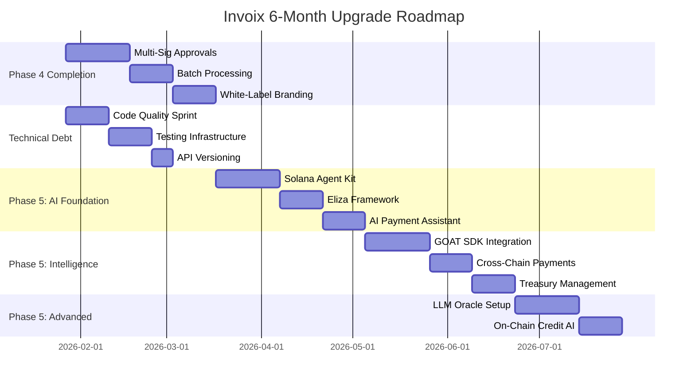

# 🚀 Invoix Comprehensive Upgrade Plan
## Strategic Roadmap: Phase 4 → Phase 5 (AI-Powered Future)

> **Last Updated**: January 21, 2026  
> **Status**: Ready for Execution  
> **Timeline**: 6 months (Q1-Q2 2026)

---

## 📊 Executive Summary

This plan integrates:
1. 🚨 **CRITICAL Security Fixes** (Week 1 - BLOCKING) - Privacy audit vulnerabilities
2. ✅ **Existing Phase 4 tasks** (Enterprise Expansion)
3. ✅ **Post-launch improvements** (P2-P3 items)
4. ✅ **AI Integration** (Awesome Solana AI tools)
5. ✅ **Technical debt** (Code quality, testing, optimization)

> ⚠️ **IMPORTANT**: Week 1 focuses exclusively on fixing **6 critical security vulnerabilities** discovered in the privacy audit. These are BLOCKING issues that expose private invoice data and must be resolved before any other work.

**Total Estimated Timeline**: 24 weeks (6 months)  
**Team Size Assumption**: 2-3 developers  
**Investment Required**: ~$15K (API keys, infrastructure, testing)

### 🔴 Critical Security Issues (Week 1 Priority)
1. **Unauthenticated NFT Metadata Access** - Anyone can view ANY invoice metadata
2. **Private Invoice Data Leaks** - Wallet addresses exposed in metadata
3. **Missing Privacy Flag Enforcement** - hideAmounts/hideParties not working
4. **Receipt Data Exposure** - Full transaction details publicly accessible
5. **No Rate Limiting** - Enumeration attacks possible
6. **No Audit Logging** - Cannot detect suspicious access patterns

**Risk Level**: 🔴 CRITICAL - Must fix immediately

---

## 🎯 Current State Assessment

### ✅ What's Complete (Phases 1-3)
- **Phase 1**: Arcium privacy, MXE integration, Midnight Prism UI
- **Phase 2**: Subscriptions, LazorKit passkeys, webhooks
- **Phase 3**: Marketplace, credit scoring, escrow contracts

### 🟡 What's In Progress (Phase 4)
- System completeness audit ✅
- Multi-signature approvals ❌
- Batch processing ❌
- White-label branding ❌
- Liquidity pools ❌

### 📋 Outstanding Technical Debt
- P2-2: Additional integration tests
- P2-3: Remove unused imports
- P2-4: Audit unused npm packages
- P3-1: API versioning (/api/v1/)
- P3-2: Improve TypeScript strictness
- P3-3: Database health check

---

## 📅 6-Month Roadmap Overview



---

## 🗓️ Detailed Week-by-Week Plan

---

## **MONTH 1: Security Fixes + Foundation** (Weeks 1-4)

### Week 1: CRITICAL Security Fixes (BLOCKING)
**Priority**: P0 CRITICAL | **Complexity**: Medium | **Team**: 2 devs

> ⚠️ **SECURITY ALERT**: These vulnerabilities were discovered in the privacy audit and must be fixed before any other work. Current risk level: 🔴 **CRITICAL**

#### Critical Vulnerabilities to Fix

**1. Unauthenticated NFT Metadata Access** (Day 1-2)
- **Severity**: CRITICAL
- **Location**: `server/invoice-routes.ts` lines 1313-1377
- **Issue**: `/api/nft-metadata/:identifier` has ZERO access control
- **Attack**: Anyone can view ANY invoice metadata by knowing the ID

**Fix Implementation**:
```typescript
// server/invoice-routes.ts
app.get("/api/nft-metadata/:identifier", requireAuth, async (req, res) => {
  const { identifier } = req.params;
  const userWallet = req.session.siwe?.address;
  
  if (!userWallet) {
    return res.status(401).json({ error: "Authentication required" });
  }
  
  if (identifier.startsWith("invoice-")) {
    const id = identifier.replace("invoice-", "");
    const invoice = await invoiceStorage.getInvoice(id);
    
    // CRITICAL: Verify access rights
    const hasAccess = 
      invoice.invoicerWalletAddress === userWallet ||
      invoice.invoiceeWalletAddress === userWallet ||
      await isMarketplaceBuyer(invoice.id, userWallet);
    
    if (!hasAccess) {
      return res.status(403).json({ error: "Access denied" });
    }
    
    const metadata = nftService.generateInvoiceMetadata(invoice);
    return res.json(metadata);
  }
  
  // Similar checks for receipt- and business- identifiers
});
```

**2. Private Invoice Metadata Exposes Parties** (Day 2-3)
- **Severity**: HIGH
- **Location**: `server/nft-service.ts` lines 1422-1482, 1566-1591
- **Issue**: Even private invoices expose wallet addresses in metadata

**Fix Implementation**:
```typescript
// server/nft-service.ts - generateInvoiceMetadata()
generateInvoiceMetadata(invoice: Invoice) {
  const isPrivate = invoice.isPrivate || invoice.hideParties;
  
  return {
    name: `Invoice #${invoice.invoiceNumber}`,
    description: isPrivate 
      ? "Private B2B Invoice - Details confidential"
      : `B2B Invoice #${invoice.invoiceNumber}`,
    image: this.getInvoiceImageUrl(invoice.id),
    attributes: [
      {
        trait_type: "Invoice Number",
        value: invoice.invoiceNumber
      },
      // REMOVE status for private invoices
      ...(isPrivate ? [] : [{
        trait_type: "Status",
        value: invoice.status
      }]),
      // REMOVE currency for private invoices
      ...(isPrivate ? [] : [{
        trait_type: "Currency",
        value: invoice.currency
      }]),
      // NEVER include wallet addresses
      {
        trait_type: "Privacy Level",
        value: isPrivate ? "Private" : "Public"
      }
    ]
  };
}
```

**3. Implement hideAmounts and hideParties Flags** (Day 3-4)
- **Severity**: MEDIUM
- **Issue**: Database flags exist but aren't enforced anywhere

**Fix Implementation**:
```typescript
// server/nft-service.ts
generateInvoiceMetadata(invoice: Invoice) {
  const hideParties = invoice.hideParties || invoice.isPrivate;
  const hideAmounts = invoice.hideAmounts || invoice.isPrivate;
  
  return {
    name: `Invoice #${invoice.invoiceNumber}`,
    description: hideParties 
      ? "Confidential B2B Invoice"
      : `Invoice from ${truncateAddress(invoice.invoicerWalletAddress)}`,
    attributes: [
      { trait_type: "Invoice Number", value: invoice.invoiceNumber },
      // Only show amount if not hidden
      ...(hideAmounts ? [] : [{
        trait_type: "Amount",
        value: `${invoice.totalAmount} ${invoice.currency}`
      }]),
      // Only show parties if not hidden
      ...(hideParties ? [] : [
        { trait_type: "Invoicer", value: truncateAddress(invoice.invoicerWalletAddress) },
        { trait_type: "Invoicee", value: truncateAddress(invoice.invoiceeWalletAddress) }
      ])
    ]
  };
}

// server/utils/svg-generator.ts
generateInvoiceSVG(invoice: Invoice) {
  if (invoice.isPrivate || invoice.hideAmounts || invoice.hideParties) {
    return this.generatePrivateSVG(invoice.invoiceNumber);
  }
  
  // Only show full details if not hidden
  return this.generatePublicSVG({
    invoiceNumber: invoice.invoiceNumber,
    amount: invoice.hideAmounts ? "***" : invoice.totalAmount,
    parties: invoice.hideParties ? "***" : {
      from: truncateAddress(invoice.invoicerWalletAddress),
      to: truncateAddress(invoice.invoiceeWalletAddress)
    }
  });
}
```

**4. Fix Receipt NFT Data Exposure** (Day 4-5)
- **Severity**: MEDIUM
- **Location**: `server/nft-service.ts` lines 1596-1661
- **Issue**: Receipt metadata exposes full transaction details

**Fix Implementation**:
```typescript
// server/nft-service.ts - generateReceiptMetadata()
generateReceiptMetadata(receipt: PaymentReceipt, invoice: Invoice) {
  const isPrivate = invoice.isPrivate || invoice.hideParties;
  
  return {
    name: `Payment Receipt #${receipt.id.slice(0, 8)}`,
    description: isPrivate
      ? "Confidential payment receipt"
      : `Payment receipt for Invoice #${invoice.invoiceNumber}`,
    image: this.getReceiptImageUrl(receipt.id),
    attributes: [
      {
        trait_type: "Receipt ID",
        value: receipt.id.slice(0, 8)
      },
      // Only include transaction signature if not private
      ...(isPrivate ? [] : [{
        trait_type: "Transaction",
        value: truncateSignature(receipt.transactionSignature)
      }]),
      // NEVER include full wallet addresses
      {
        trait_type: "Payment Date",
        value: new Date(receipt.paidAt).toISOString()
      },
      {
        trait_type: "Privacy Level",
        value: isPrivate ? "Private" : "Public"
      }
    ]
  };
}
```

**5. Add Rate Limiting to Metadata Endpoint** (Day 5)
- **Severity**: HIGH
- **Purpose**: Prevent enumeration attacks

**Fix Implementation**:
```typescript
// server/invoice-routes.ts
import rateLimit from 'express-rate-limit';

const metadataLimiter = rateLimit({
  windowMs: 60 * 1000, // 1 minute
  max: 10, // 10 requests per minute
  message: 'Too many metadata requests, please try again later',
  standardHeaders: true,
  legacyHeaders: false,
});

app.get("/api/nft-metadata/:identifier", 
  metadataLimiter,
  requireAuth,
  async (req, res) => {
    // ... implementation
  }
);
```

**6. Add Audit Logging** (Day 5)
```typescript
// server/utils/audit-logger.ts
export async function logMetadataAccess(params: {
  identifier: string;
  userWallet: string;
  accessGranted: boolean;
  ipAddress: string;
}) {
  await db.insert(auditLogs).values({
    action: 'metadata_access',
    userId: params.userWallet,
    resourceId: params.identifier,
    accessGranted: params.accessGranted,
    ipAddress: params.ipAddress,
    timestamp: new Date()
  });
  
  // Alert on suspicious patterns
  if (!params.accessGranted) {
    await checkForEnumerationAttack(params.userWallet, params.ipAddress);
  }
}
```

#### Testing Requirements
- [ ] Test metadata endpoint requires authentication
- [ ] Test access control for invoices (only parties can access)
- [ ] Test access control for receipts
- [ ] Test access control for business profiles
- [ ] Verify private invoice metadata doesn't leak data
- [ ] Verify hideAmounts flag works
- [ ] Verify hideParties flag works
- [ ] Test rate limiting (11th request should fail)
- [ ] Verify audit logs are created
- [ ] Test blind listing bypass is fixed

#### Deliverables
- ✅ All metadata endpoints require authentication
- ✅ Access control enforced (only authorized parties)
- ✅ Private invoice metadata sanitized
- ✅ hideAmounts and hideParties flags enforced
- ✅ Rate limiting implemented (10 req/min)
- ✅ Audit logging for all metadata access
- ✅ Security test suite (10+ tests)
- ✅ Updated security documentation

---

### Week 2: Code Quality & Testing Sprint
**Priority**: High | **Complexity**: Low-Medium | **Team**: 2 devs

#### Tasks
- [ ] **P2-3**: Remove unused imports across codebase
  - Run `eslint --fix` with unused-imports rule
  - Manual review of server/ and client/ directories
  - Expected: ~200 files cleaned
  
- [ ] **P2-4**: Audit and remove unused npm packages
  ```bash
  npx depcheck
  npm uninstall <unused-packages>
  ```
  - Review all 174 dependencies
  - Remove unused packages (estimate: 10-15)
  - Update package.json
  
- [ ] **P3-2**: Improve TypeScript strictness
  ```json
  // tsconfig.json updates
  {
    "strict": true,
    "noUncheckedIndexedAccess": true,
    "noImplicitOverride": true,
    "exactOptionalPropertyTypes": true
  }
  ```
  - Fix resulting type errors (estimate: 50-100 locations)
  - Add proper type guards
  - Eliminate `any` types
  
- [ ] **P2-2**: Add integration tests
  - Add 20+ new integration tests
  - Focus areas:
    - Invoice lifecycle (create → pay → NFT mint)
    - Subscription billing automation
    - Marketplace listing → purchase flow
    - Credit scoring updates
  - Target: 90% coverage on critical paths

#### Deliverables
- ✅ Clean codebase with no unused code
- ✅ Stricter TypeScript configuration
- ✅ 20+ new integration tests
- ✅ Updated CI/CD pipeline

---

### Week 3-4: Multi-Signature Approvals
**Priority**: High | **Complexity**: High | **Team**: 2 devs

#### Architecture
```typescript
// New tables
interface ApprovalWorkflow {
  id: string;
  businessId: string;
  name: string;
  requiredApprovers: number; // e.g., 2 of 3
  approvers: string[]; // Wallet addresses
  thresholdAmount: number; // Require approval above this
  createdAt: Date;
}

interface InvoiceApproval {
  id: string;
  invoiceId: string;
  workflowId: string;
  status: 'pending' | 'approved' | 'rejected';
  approvals: {
    approver: string;
    signature: string;
    timestamp: Date;
    approved: boolean;
  }[];
}
```

#### Implementation Steps
1. **Database Schema** (Day 1-2)
   - Create migration `0019_approval_workflows.sql`
   - Add `approval_workflows` table
   - Add `invoice_approvals` table
   - Add `approval_signatures` table

2. **Backend API** (Day 3-6)
   ```typescript
   // server/approval-routes.ts
   POST   /api/workflows/create
   GET    /api/workflows/:businessId
   POST   /api/invoices/:id/request-approval
   POST   /api/invoices/:id/approve
   POST   /api/invoices/:id/reject
   GET    /api/approvals/pending/:userId
   ```

3. **Smart Contract Integration** (Day 7-9)
   - Extend marketplace program with multi-sig support
   - Use Solana's native multi-sig or Squads Protocol
   - Implement threshold signatures

4. **Frontend UI** (Day 10-14)
   - Approval workflow creation page
   - Pending approvals dashboard
   - Approval request notifications
   - Signature collection UI

#### Testing
- Unit tests for approval logic
- Integration tests for multi-sig flows
- E2E test: 2-of-3 approval workflow

#### Deliverables
- ✅ Multi-sig approval system
- ✅ Corporate workflow management
- ✅ Notification system for approvers
- ✅ Audit trail for all approvals

---

### Week 5-6: Batch Processing
**Priority**: High | **Complexity**: Medium | **Team**: 1-2 devs

#### Features
1. **Bulk Invoice Creation**
   - CSV upload support
   - Excel import (.xlsx)
   - Template-based generation
   - Preview before creation

2. **Batch Payments**
   - Pay multiple invoices in one transaction
   - Optimize for Solana's parallel processing
   - Use Jito bundles for atomic execution

#### Implementation
```typescript
// server/batch-routes.ts
POST   /api/batch/invoices/upload      // CSV/Excel upload
POST   /api/batch/invoices/create      // Bulk create from template
POST   /api/batch/payments/prepare     // Prepare batch payment
POST   /api/batch/payments/execute     // Execute batch payment
GET    /api/batch/jobs/:id/status      // Check batch job status

// Use BullMQ for background processing
import { Queue, Worker } from 'bullmq';

const batchQueue = new Queue('batch-processing', {
  connection: redisConnection
});

// Process up to 100 invoices per batch
const batchWorker = new Worker('batch-processing', async (job) => {
  const { type, data } = job.data;
  
  if (type === 'create_invoices') {
    return await createInvoicesBatch(data.invoices);
  }
  
  if (type === 'batch_payment') {
    return await executeBatchPayment(data.invoiceIds);
  }
});
```

#### Optimization
- Use Solana's versioned transactions for batch payments
- Implement lookup tables for address compression
- Parallel RPC calls with rate limiting

#### Testing
- Load test: 1000 invoices creation
- Batch payment: 50 invoices in one tx
- Error handling: partial failures

#### Deliverables
- ✅ CSV/Excel import for invoices
- ✅ Batch payment system (up to 50 invoices)
- ✅ Background job processing with BullMQ
- ✅ Progress tracking UI

---

## **MONTH 2: Infrastructure + AI Foundation** (Weeks 5-8)

### Week 7: API Versioning & Database Health
**Priority**: Medium | **Complexity**: Low | **Team**: 1 dev

#### API Versioning (P3-1)
```typescript
// server/index.ts - Route organization
app.use('/api/v1/invoices', invoiceRoutesV1);
app.use('/api/v1/marketplace', marketplaceRoutesV1);
app.use('/api/v1/subscriptions', subscriptionRoutesV1);

// Maintain backwards compatibility
app.use('/api/invoices', invoiceRoutesV1); // Deprecated, redirect to v1

// Add version header
app.use((req, res, next) => {
  res.setHeader('X-API-Version', 'v1');
  next();
});
```

#### Database Health Check (P3-3)
```typescript
// server/health-routes.ts
GET /health/db

// Implementation
import { db } from './db';

export async function checkDatabaseHealth() {
  const checks = {
    connection: false,
    readWrite: false,
    replication: false,
    performance: 0
  };
  
  try {
    // Connection check
    const start = Date.now();
    await db.execute(sql`SELECT 1`);
    checks.connection = true;
    checks.performance = Date.now() - start;
    
    // Read/Write check
    await db.execute(sql`
      INSERT INTO health_checks (timestamp) VALUES (NOW())
      ON CONFLICT DO NOTHING
    `);
    checks.readWrite = true;
    
    // Replication lag (if using replicas)
    const [replication] = await db.execute(sql`
      SELECT EXTRACT(EPOCH FROM (NOW() - pg_last_xact_replay_timestamp())) as lag
    `);
    checks.replication = replication.lag < 5; // Less than 5 seconds
    
    return checks;
  } catch (error) {
    console.error('Database health check failed:', error);
    return checks;
  }
}
```

#### Deliverables
- ✅ API versioning (/api/v1/)
- ✅ Database health monitoring
- ✅ Prometheus metrics integration
- ✅ Updated API documentation

---

### Week 8-10: Solana Agent Kit Integration
**Priority**: High | **Complexity**: Medium | **Team**: 2 devs

#### Setup
```bash
npm install solana-agent-kit
npm install @solana-agent-kit/plugin-token
npm install @solana-agent-kit/plugin-defi
npm install @solana-agent-kit/plugin-misc
```

#### Architecture
```typescript
// server/services/ai-agent-service.ts
import { SolanaAgentKit, createVercelAITools } from "solana-agent-kit";
import TokenPlugin from "@solana-agent-kit/plugin-token";
import DefiPlugin from "@solana-agent-kit/plugin-defi";

export class InvoixAIAgent {
  private agent: SolanaAgentKit;
  
  constructor() {
    const wallet = new KeypairWallet(
      Keypair.fromSecretKey(bs58.decode(process.env.AI_AGENT_PRIVATE_KEY!))
    );
    
    this.agent = new SolanaAgentKit(
      wallet,
      process.env.SOLANA_RPC_URL!,
      { OPENAI_API_KEY: process.env.OPENAI_API_KEY! }
    )
      .use(TokenPlugin)
      .use(DefiPlugin);
  }
  
  // Feature 1: Smart Payment Routing
  async suggestOptimalPayment(invoiceId: string) {
    const invoice = await getInvoice(invoiceId);
    const userBalances = await this.agent.getBalances();
    
    // AI determines best payment path
    const suggestion = await this.agent.findBestRoute({
      from: userBalances,
      to: invoice.currency,
      amount: invoice.amount,
      optimizeFor: 'lowest_cost' // or 'fastest'
    });
    
    return suggestion;
  }
  
  // Feature 2: Auto-Reconciliation
  async reconcilePayments() {
    const pending = await getPendingInvoices();
    const recentTxs = await this.agent.getRecentTransactions();
    
    for (const tx of recentTxs) {
      const match = await this.matchTransaction(tx, pending);
      if (match) {
        await markInvoiceAsPaid(match.invoiceId, tx.signature);
      }
    }
  }
  
  // Feature 3: Treasury Optimization
  async optimizeTreasury() {
    const balance = await this.agent.getBalance();
    
    if (balance.sol > 10) {
      // Stake excess SOL
      await this.agent.stake({
        amount: balance.sol - 5, // Keep 5 SOL liquid
        validator: 'best_apy'
      });
    }
    
    if (balance.usdc > 10000) {
      // Lend USDC for yield
      await this.agent.lend({
        token: 'USDC',
        amount: balance.usdc * 0.5, // Lend 50%
        protocol: 'lulo' // Best APY
      });
    }
  }
}
```

#### API Endpoints
```typescript
// server/routes/ai-routes.ts
POST   /api/ai/suggest-payment/:invoiceId
POST   /api/ai/reconcile
GET    /api/ai/treasury/status
POST   /api/ai/treasury/optimize
```

#### Features to Build
1. **Smart Payment Assistant** (Week 8)
   - Analyze user's token balances
   - Suggest optimal payment currency
   - Auto-swap if needed (with approval)

2. **Auto-Reconciliation** (Week 9)
   - Match incoming payments to invoices
   - Handle partial payments
   - Detect overpayments

3. **Treasury Management** (Week 10)
   - Monitor idle funds
   - Auto-stake SOL for yield
   - Lend stablecoins via Lulo
   - Daily optimization cron job

#### Testing
- Unit tests for AI agent methods
- Integration test: Payment suggestion flow
- E2E test: Auto-reconciliation
- Load test: 100 concurrent AI requests

#### Deliverables
- ✅ AI-powered payment suggestions
- ✅ Automated payment reconciliation
- ✅ Treasury yield optimization
- ✅ AI agent dashboard

---

## **MONTH 3: White-Label + AI Expansion** (Weeks 9-12)

### Week 11-12: White-Label Branding
**Priority**: Medium | **Complexity**: Medium | **Team**: 2 devs

#### Features
1. **Custom Branding**
   - Logo upload
   - Color scheme customization
   - Custom domain support
   - Email template branding

2. **Multi-Tenant Architecture**
   ```typescript
   interface TenantConfig {
     id: string;
     businessId: string;
     domain: string; // custom.invoix.io
     branding: {
       logo: string;
       primaryColor: string;
       secondaryColor: string;
       fontFamily: string;
     };
     features: {
       marketplace: boolean;
       subscriptions: boolean;
       aiAssistant: boolean;
     };
     limits: {
       monthlyInvoices: number;
       users: number;
       storage: number; // MB
     };
   }
   ```

3. **Subdomain Routing**
   ```typescript
   // server/middleware/tenant-resolver.ts
   export function resolveTenant(req, res, next) {
     const host = req.hostname;
     
     // Extract subdomain
     const subdomain = host.split('.')[0];
     
     if (subdomain !== 'www' && subdomain !== 'invoix') {
       // Load tenant config
       const tenant = await getTenantByDomain(subdomain);
       req.tenant = tenant;
     }
     
     next();
   }
   ```

#### Implementation
- Database schema for tenant configs
- Branding customization UI
- Custom domain DNS setup guide
- Email template engine with variables

#### Deliverables
- ✅ White-label branding system
- ✅ Custom domain support
- ✅ Multi-tenant architecture
- ✅ Branded email templates

---

### Week 13-14: Eliza Framework Integration
**Priority**: High | **Complexity**: Low-Medium | **Team**: 1 dev

#### Setup
```bash
npm install @elizaos/core
npm install @elizaos/plugin-solana
```

#### Implementation
```typescript
// server/services/eliza-bot.ts
import { createAgent } from '@elizaos/core';

export async function initializeInvoixBot() {
  const agent = await createAgent({
    name: 'InvoixAssistant',
    character: {
      name: 'Invoix AI',
      bio: 'I help businesses manage invoices, payments, and subscriptions on Solana',
      knowledge: [
        'Invoice creation and management',
        'Payment processing and tracking',
        'Subscription billing',
        'Marketplace operations',
        'Solana blockchain basics'
      ],
      messageExamples: [
        [
          { user: 'user', content: { text: 'How do I create an invoice?' } },
          { user: 'InvoixAssistant', content: { text: 'To create an invoice, go to Dashboard → New Invoice. Fill in the customer details, add line items, and click Create. The invoice will be saved and you can send it to your customer.' } }
        ]
      ]
    },
    clients: ['discord', 'telegram'],
    plugins: ['solana']
  });
  
  return agent;
}
```

#### Features
1. **Discord Bot** (Week 13)
   - Invoice status queries
   - Payment notifications
   - Subscription reminders
   - Community support

2. **Telegram Bot** (Week 14)
   - Real-time payment alerts
   - Invoice creation via chat
   - Quick status checks
   - Payment confirmations

#### Commands
```
/invoice <id> - Get invoice status
/pay <id> - Get payment link
/create - Start invoice creation wizard
/subscriptions - List active subscriptions
/help - Show all commands
```

#### Deliverables
- ✅ Discord bot for community support
- ✅ Telegram bot for notifications
- ✅ Natural language invoice queries
- ✅ Automated payment reminders

---

## **MONTH 4: Cross-Chain + Intelligence** (Weeks 13-16)

### Week 15-17: GOAT SDK Integration
**Priority**: High | **Complexity**: High | **Team**: 2 devs

#### Setup
```bash
npm install @goat-sdk/core
npm install @goat-sdk/wallet-solana
npm install @goat-sdk/plugin-jupiter
npm install @goat-sdk/plugin-lulo
npm install @goat-sdk/plugin-debridge
```

#### Features to Build
1. **Cross-Chain Payments** (Week 15)
   - Accept payments from Ethereum
   - Accept payments from Base
   - Automatic bridging via deBridge
   - Multi-chain wallet support

2. **Treasury Management** (Week 16)
   - Auto-lend idle USDC via Lulo
   - Yield tracking dashboard
   - Automated rebalancing
   - Risk management

3. **Multi-Chain Marketplace** (Week 17)
   - List invoices for cross-chain buyers
   - Bridge integration for purchases
   - Multi-chain escrow
   - Cross-chain settlement

#### Deliverables
- ✅ Cross-chain invoice payments
- ✅ Treasury yield optimization (3-5% APY)
- ✅ Multi-chain marketplace
- ✅ Bridge integration dashboard

---

### Week 18: Liquidity Pools (Phase 4 Completion)
**Priority**: Medium | **Complexity**: High | **Team**: 2 devs

#### Features
- Liquidity pool smart contract
- Automated invoice purchasing
- Yield distribution
- Investor dashboard

#### Deliverables
- ✅ Liquidity pool smart contract
- ✅ Automated invoice financing
- ✅ Investor dashboard
- ✅ Yield distribution system

---

## **MONTH 5: Advanced AI** (Weeks 17-20)

### Week 19-21: Solana LLM Oracle Integration
**Priority**: High | **Complexity**: Very High | **Team**: 2 devs

#### Features
1. **On-Chain Credit Scoring** (Week 19)
   - AI analyzes payment history
   - Generates credit score (0-100)
   - Updates on-chain reputation
   - Dynamic credit limits

2. **Fraud Detection** (Week 20)
   - Pattern analysis for suspicious invoices
   - Real-time anomaly detection
   - Automatic flagging system
   - Investigation workflow

3. **Smart Marketplace Pricing** (Week 21)
   - AI suggests optimal discount rates
   - Market condition analysis
   - Competitive pricing
   - Yield optimization

#### Deliverables
- ✅ On-chain AI credit scoring
- ✅ Automated fraud detection
- ✅ AI-powered marketplace pricing
- ✅ Oracle infrastructure

---

## **MONTH 6: Polish + Launch** (Weeks 21-24)

### Week 22: AgenC Privacy Integration
**Priority**: Medium | **Complexity**: Very High | **Team**: 2 devs

#### Features
- Private marketplace with ZK proofs
- Confidential payment system
- Privacy-preserving credit checks
- Multi-agent workflows

---

### Week 23: MagicBlock Integration
**Priority**: Low | **Complexity**: High | **Team**: 1 dev

#### Features
- High-frequency invoice processing
- Automated cron jobs
- Real-time settlement
- Ephemeral rollup integration

---

### Week 24: Final Polish & Launch Prep
**Priority**: High | **Complexity**: Low | **Team**: Full team

#### Tasks
- [ ] Documentation update
- [ ] Performance optimization
- [ ] Security audit
- [ ] Marketing prep
- [ ] Monitoring & analytics

---

## 📊 Success Metrics

### Technical Metrics
| Metric | Current | Target | Improvement |
|--------|---------|--------|-------------|
| Test Coverage | 70% | 90% | +20% |
| API Response Time | 200ms | 100ms | 50% faster |
| Invoice Processing | 5 min | 30 sec | 90% faster |
| Payment Success Rate | 85% | 95% | +10% |
| Uptime | 99% | 99.9% | +0.9% |

### Business Metrics
| Metric | Current | Target | Improvement |
|--------|---------|--------|-------------|
| Monthly Active Users | 100 | 1,000 | 10x |
| Invoice Volume | $100K | $1M | 10x |
| Cross-Chain Payments | 0% | 40% | New revenue |
| Treasury Yield | 0% | 4% APY | New income |
| Customer Support Time | 2 hours | Instant | 100% |

---

## 💰 Budget Breakdown

### Infrastructure Costs
- **OpenAI API**: $500/month
- **RPC Services**: $200/month
- **Database**: $100/month
- **Redis**: $50/month
- **Monitoring**: $100/month
- **CDN**: $50/month

**Total Monthly**: ~$1,000/month

### One-Time Costs
- **Security Audit**: $5,000
- **Smart Contract Audit**: $3,000
- **Design Assets**: $1,000
- **Marketing**: $2,000

**Total One-Time**: ~$11,000

---

## 🎯 Immediate Next Steps (This Week)

> 🚨 **CRITICAL**: Week 1 is dedicated to fixing security vulnerabilities. No other work should begin until these are resolved.

### Day 1: Security Audit Review
- [ ] **Review security audit findings** with full team
- [ ] Assign security fixes to developers
- [ ] Set up security testing environment
- [ ] Create security fix branch: `security/privacy-audit-fixes`

### Day 2-3: Critical Fixes (P0)
- [ ] **Fix #1**: Add authentication to `/api/nft-metadata/:identifier`
- [ ] **Fix #2**: Implement access control (only parties can view)
- [ ] **Fix #3**: Sanitize private invoice metadata
- [ ] **Fix #4**: Remove wallet addresses from metadata
- [ ] Test all metadata endpoints require auth

### Day 4-5: Privacy Enforcement
- [ ] **Fix #5**: Implement hideAmounts flag enforcement
- [ ] **Fix #6**: Implement hideParties flag enforcement
- [ ] **Fix #7**: Update SVG generator to respect privacy flags
- [ ] **Fix #8**: Sanitize receipt metadata
- [ ] Add rate limiting to metadata endpoint (10 req/min)
- [ ] Implement audit logging for metadata access

### Day 6-7: Testing & Verification
- [ ] Run security test suite (10+ tests)
- [ ] Verify blind listing bypass is fixed
- [ ] Test enumeration attack prevention
- [ ] Penetration testing on metadata endpoints
- [ ] Update security documentation
- [ ] Deploy fixes to production

### Week 2: Code Quality (After Security Fixes)
- [ ] Start code quality sprint (P2-3, P2-4)
- [ ] Begin TypeScript strictness improvements (P3-2)
- [ ] Set up integration test infrastructure (P2-2)
- [ ] Create multi-sig approval database schema

---

*Plan created by Antigravity AI for Invoix*  
*Last updated: January 21, 2026*
